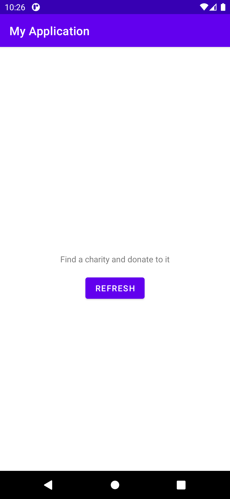

# RandomThings
This app uses the Bored API to help you find things to do when you're bored.

## Main Features
1. Kotlin
2. MVVM - Single Activity Architecture
3. DataBinding - ViewBinding
4. Flow - StateFlow
5. Coroutine
6. Dagger 2 DI
7. Retrofit 2
8. Moshi

## Preview

